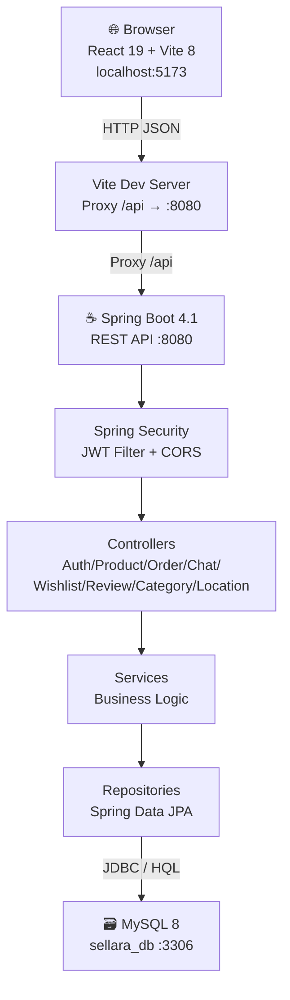
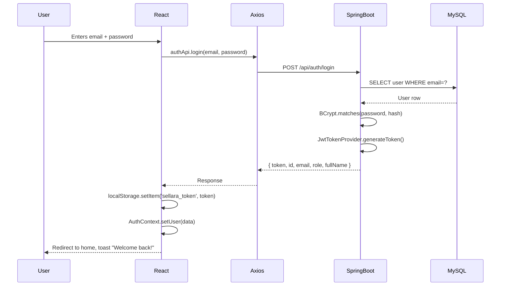

# Architecture — Resellara

> **Navigation:** [README](README.md) · [Frontend](FRONTEND.md) · [Backend](BACKEND.md) · [Database](DATABASE.md) · [API](API_DOCUMENTATION.md) · [Workflows](WORKFLOWS.md) · [Security](SECURITY.md) · [Setup](SETUP_AND_RUN.md)

---

## Overview

Resellara follows a classic **three-tier architecture**:

```
Browser (React + Vite)  →  Spring Boot REST API  →  MySQL 8 Database
         :5173                     :8080                  :3306
```

The three tiers are completely separate processes. They communicate via:
- **Browser ↔ Backend:** HTTP/HTTPS using JSON (via Axios).
- **Backend ↔ Database:** JDBC via MySQL Connector/J, managed by Hibernate/JPA.

---

## High-Level Architecture Diagram



**Plain-English explanation:**
- The user opens `http://localhost:5173` in their browser.
- React renders the UI pages.
- When the page needs data (e.g., product list), it calls Axios which sends an HTTP request to `/api/products`.
- Vite's development proxy forwards that call to `http://localhost:8080/api/products`.
- Spring Boot's **JWT Filter** checks the `Authorization` header.
- The request reaches the **Controller**, which calls the **Service**, which calls the **Repository**, which queries MySQL.
- The response travels back as JSON to Axios, which gives it to React, which re-renders the UI.

---

## Request-Response Lifecycle — Real Example

**Scenario: Seller accepts an offer**

```
Frontend (OrderModal.jsx)
  ↓  PATCH /api/orders/42/status  { "status": "ACCEPTED" }
  ↓  Authorization: Bearer <JWT token>

Vite proxy → http://localhost:8080/api/orders/42/status

JwtAuthenticationFilter
  ↓  Extracts token from "Authorization" header
  ↓  Calls JwtTokenProvider.validateToken(token) — true
  ↓  Calls UserDetailsServiceImpl.loadUserByUsername(email)
  ↓  Sets authentication in SecurityContextHolder

SecurityConfig
  ↓  hasAuthority('ROLE_SELLER') → allowed

OrderController.updateOrderStatus(principal, id=42, req)
  ↓  Calls OrderService.updateOrderStatus(sellerId, 42, ACCEPTED)

OrderService (inside @Transactional)
  ↓  Fetches Order 42 from OrderRepository
  ↓  Calls productRepository.findByIdWithPessimisticLock(productId)
       → MySQL executes: SELECT ... FOR UPDATE  ← exclusive row lock
  ↓  Checks product.status == AVAILABLE → OK
  ↓  Sets order.status = ACCEPTED
  ↓  Sets product.status = RESERVED
  ↓  Saves product
  ↓  Fetches all other PENDING orders for same product → sets REJECTED
  ↓  Sends in-chat notification to winning buyer
  ↓  Sends in-chat notification to each declined buyer
  ↓  Saves updated order
  ↓  Releases lock (transaction commits)
  ↓  Returns OrderResponse

OrderController
  ↓  Returns HTTP 200 with ApiResponse<OrderResponse> JSON

Axios (Frontend)
  ↓  Receives response
  ↓  Updates React state → UI shows "ACCEPTED"
  ↓  react-hot-toast shows "Order status updated successfully"
```

---

## Authentication Flow



**Every subsequent request:**
```
Axios interceptor → config.headers.Authorization = `Bearer ${token}`
JwtAuthenticationFilter → validates token → sets SecurityContext
Controller → @AuthenticationPrincipal UserPrincipal principal
```

---

## Role-Based Authorization

| Route / Feature | Rule |
|-----------------|------|
| `GET /api/products/**` | Public — no token required |
| `GET /api/categories/**` | Public |
| `GET /api/locations/**` | Public |
| `GET /api/reviews/**` | Public |
| `POST /api/auth/**` | Public |
| `POST /api/products/seller/**` | Must have `ROLE_SELLER` (`@PreAuthorize`) |
| `GET /api/orders/seller` | Must have `ROLE_SELLER` |
| `PATCH /api/orders/{id}/status` | Must have `ROLE_SELLER` |
| `POST /api/orders` | Any authenticated user |
| `GET /api/wishlist` | Any authenticated user |
| `POST /api/reviews` | Any authenticated user (service enforces buyer+completed) |
| Frontend `/seller` route | `ProtectedRoute requiredRole="ROLE_SELLER"` |

---

## Folder Structure

### Frontend (`frontend/src/`)

```
src/
├── main.jsx              Entry point — renders <App /> into index.html
├── App.jsx               Root component — BrowserRouter, providers, routes
├── api/
│   ├── axiosClient.js    Shared Axios instance with base URL and interceptors
│   ├── authApi.js        Auth-related API calls (login, register, OTP, reset)
│   ├── productApi.js     Product search, CRUD, price suggestion
│   ├── orderApi.js       Create order, list buyer/seller orders, update status
│   ├── chatApi.js        Conversations and messages
│   ├── wishlistApi.js    Get wishlist, toggle, get IDs
│   ├── reviewApi.js      Submit review, get seller reviews, get order review
│   ├── categoryApi.js    Fetch categories
│   └── locationApi.js    Search Indian locations
├── context/
│   ├── AuthContext.jsx   Global auth state (user, token, login, logout, register)
│   ├── WishlistContext.jsx  Wishlist ID cache and toggle helper
│   └── ChatContext.jsx   Conversation list and unread count state
├── components/
│   ├── common/
│   │   ├── Navbar.jsx          Top navigation bar
│   │   ├── Footer.jsx          Footer
│   │   ├── ProtectedRoute.jsx  Guards routes by role/auth
│   │   ├── LoadingSpinner.jsx  Reusable spinner
│   │   ├── EmptyState.jsx      Empty list placeholder
│   │   └── LocationAutocomplete.jsx  Searches Indian cities
│   ├── product/
│   │   ├── ProductCard.jsx     Card shown in product grid
│   │   ├── ProductFilters.jsx  Sidebar/panel with filter controls
│   │   └── ProductFormModal.jsx  Create/edit product modal (seller)
│   ├── order/
│   │   └── OrderModal.jsx      Place offer / view seller orders
│   ├── chat/
│   │   └── ChatDrawer.jsx      Slide-out chat panel
│   └── review/
│       └── ReviewModal.jsx     Submit or view a review
├── pages/
│   ├── HomePage.jsx            Browse and search products
│   ├── ProductDetailsPage.jsx  View one product detail
│   ├── SellerDashboardPage.jsx Seller's listing + offer management
│   ├── MyOrdersPage.jsx        Buyer's order history
│   ├── WishlistPage.jsx        Buyer's saved items
│   ├── LoginPage.jsx           Login form
│   └── RegisterPage.jsx        Registration with OTP flow
└── utils/
    └── formatters.js           Date/currency formatting helpers
```

### Backend (`backend/src/main/java/com/sellara/`)

```
com/sellara/
├── SellaraBackendApplication.java   Spring Boot main class
├── config/
│   └── SecurityConfig.java          CORS, CSRF, session, JWT filter, role rules
├── controller/                       HTTP endpoints — receive request, return response
│   ├── AuthController.java
│   ├── ProductController.java
│   ├── OrderController.java
│   ├── ChatController.java
│   ├── WishlistController.java
│   ├── ReviewController.java
│   ├── CategoryController.java
│   └── LocationController.java
├── service/                          Business logic — validation, state changes
│   ├── AuthService.java
│   ├── ProductService.java
│   ├── OrderService.java
│   ├── ChatService.java
│   ├── WishlistService.java
│   ├── ReviewService.java
│   ├── EmailOtpService.java
│   ├── EmailService.java
│   ├── LocationService.java
│   ├── PriceSuggestionService.java
│   └── DataInitializerService.java
├── repository/                       Database access — extends JpaRepository
│   ├── UserRepository.java
│   ├── ProductRepository.java
│   ├── OrderRepository.java
│   ├── ConversationRepository.java
│   ├── ChatMessageRepository.java
│   ├── WishlistRepository.java
│   ├── ReviewRepository.java
│   └── EmailOtpRepository.java
├── entity/                           JPA-mapped database tables
│   ├── User.java
│   ├── Product.java
│   ├── Order.java
│   ├── Conversation.java
│   ├── ChatMessage.java
│   ├── WishlistItem.java
│   ├── Review.java
│   ├── EmailOtp.java
│   ├── Category.java
│   ├── Role.java          (enum)
│   ├── ProductStatus.java (enum)
│   ├── OrderStatus.java   (enum)
│   ├── Condition.java     (enum)
│   └── OtpType.java       (enum)
├── dto/                              Data Transfer Objects (request/response shapes)
│   ├── auth/
│   ├── product/
│   ├── order/
│   ├── chat/
│   ├── review/
│   ├── location/
│   └── common/ApiResponse.java
├── security/
│   ├── JwtTokenProvider.java        Creates and validates JWT tokens
│   ├── JwtAuthenticationFilter.java Per-request JWT check (OncePerRequestFilter)
│   ├── UserDetailsServiceImpl.java  Loads User from DB by email
│   └── UserPrincipal.java           Spring Security identity object
└── exception/
    ├── BadRequestException.java       → 400
    ├── ResourceNotFoundException.java → 404
    └── GlobalExceptionHandler.java    @RestControllerAdvice catches all exceptions
```

---

## Key Design Patterns

| Pattern | Where Used |
|---------|-----------|
| **Layered architecture** | Controller → Service → Repository → Entity |
| **DTO (Data Transfer Object)** | Separate request/response classes prevent leaking entity internals |
| **Repository pattern** | Spring Data JPA generates SQL from interface method names |
| **Filter pattern** | `JwtAuthenticationFilter` runs before every request |
| **Global exception handler** | `GlobalExceptionHandler` maps exceptions to HTTP status codes |
| **Context API (React)** | `AuthContext`, `WishlistContext`, `ChatContext` share state across components |
| **Interceptor pattern (Axios)** | Attaches JWT token to every outgoing request automatically |
