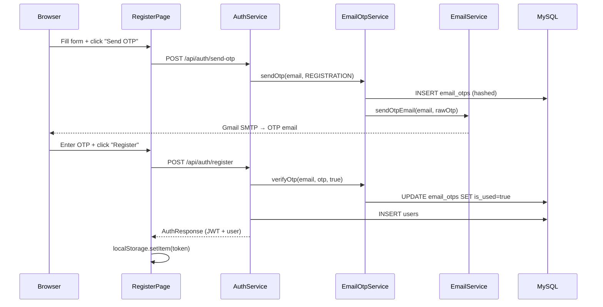
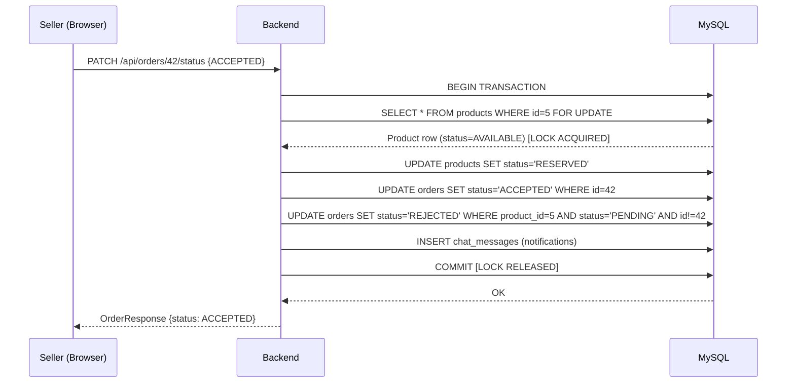

# End-to-End Workflows — Resellara

> **Navigation:** [README](README.md) · [Architecture](ARCHITECTURE.md) · [API](API_DOCUMENTATION.md) · [Security](SECURITY.md)

---

## Workflow 1: Buyer Registration with Email OTP

### Step-by-Step

1. **User opens** `http://localhost:5173/register`.
2. **Page:** `RegisterPage.jsx` — user fills name, email, phone, city, role (ROLE_BUYER), password, confirm password.
3. **User clicks "Send OTP"** → `authApi.sendOtp(email, 'REGISTRATION')` → `POST /api/auth/send-otp`.
4. **Backend:** `AuthService.sendOtp` → `EmailOtpService.sendOtp`:
   - Checks email not already registered.
   - Generates 6-digit code via `SecureRandom`.
   - SHA-256 hashes code → saves to `email_otps` table.
   - Sends raw code via Gmail SMTP (`EmailService`).
5. **User receives email**, enters OTP code in form.
6. **User clicks "Register"** → `authApi.register({...userData, otp})` → `POST /api/auth/register`.
7. **Backend:**
   - Verifies OTP (hash comparison) and marks it used.
   - Validates password strength (regex).
   - BCrypt-hashes password.
   - Saves `User` row in `users` table.
   - Generates JWT.
8. **Frontend:** Stores token and user in `localStorage`; updates `AuthContext`; navigates to home.

### Database Changes
- `email_otps`: INSERT (send OTP), UPDATE `is_used=true` (register)
- `users`: INSERT

### Sequence Diagram



---

## Workflow 2: Login and Authenticated API Requests

1. **User visits** `/login` → `LoginPage.jsx`.
2. Enters email + password → `AuthContext.login(email, password)` → `POST /api/auth/login`.
3. **Backend** verifies credentials via `AuthenticationManager` → BCrypt compare.
4. Returns `AuthResponse` with JWT (24-hour expiry).
5. Frontend stores `sellara_token` in `localStorage` and user data as `sellara_user`.
6. **Every subsequent API call:** Axios request interceptor reads `sellara_token` and adds `Authorization: Bearer <token>` header.
7. **Backend** `JwtAuthenticationFilter` extracts token → validates signature → loads user → sets `SecurityContextHolder`.

**Forgot Password flow:**
1. `LoginPage` → "Forgot Password?" → send OTP with type `FORGOT_PASSWORD`.
2. User enters OTP → `POST /api/auth/reset-password` with new password.
3. Backend validates OTP, BCrypt-hashes new password, updates `users.password`.

---

## Workflow 3: Seller Creates a Product Listing

1. Seller is logged in with `ROLE_SELLER` and visits `/seller` → `SellerDashboardPage.jsx`.
2. Clicks "New Listing" → `ProductFormModal.jsx` opens.
3. Form includes: title, description, category (loaded from `GET /api/categories`), condition, price, optional original price, image URL, location (via `LocationAutocomplete`).
4. Optionally clicks "Suggest Price" → `POST /api/products/price-suggestion` (rule-based calculator).
5. Submits form → `productApi.createProduct(formData)` → `POST /api/products/seller`.
6. **Backend** `ProductController` → `ProductService.createProduct`:
   - Validates seller ownership via `@PreAuthorize("hasAuthority('ROLE_SELLER')")`.
   - Creates `Product` entity with `status = AVAILABLE`.
   - Saves to MySQL.
7. Frontend refreshes listings grid with new product.

### Database Changes
- `products`: INSERT with status `AVAILABLE`

---

## Workflow 4: Buyer Browses and Searches Products

1. Buyer visits `http://localhost:5173` → `HomePage.jsx`.
2. Products loaded via `productApi.getProducts({})` → `GET /api/products`.
3. Only `AVAILABLE` products are returned.
4. **Search:** User types in Navbar search bar → URL updates to `/?q=laptop` → `getProducts({query: 'laptop'})`.
5. **Filters:** `ProductFilters.jsx` — category dropdown, condition, min/max price, location autocomplete.
6. All filters combine into a single JPQL query in `ProductRepository.searchProducts`.
7. Clicking a `ProductCard` navigates to `/products/{id}` → `ProductDetailsPage.jsx` → `GET /api/products/{id}`.

---

## Workflow 5: Wishlist Operations

1. Logged-in buyer sees heart icon on each `ProductCard`.
2. On login, `WishlistContext` fetches all wishlisted IDs via `GET /api/wishlist/ids`.
3. Heart icon is filled if `productId` is in wishlisted IDs set.
4. Clicking heart → `wishlistApi.toggleWishlist(productId)` → `POST /api/wishlist/toggle/{productId}`.
5. Backend `WishlistService.toggleWishlist`:
   - Checks if `WishlistItem(user, product)` exists.
   - If yes → delete; if no → insert.
   - Returns `isWishlisted` boolean.
6. `WishlistContext` updates local set immediately.
7. `WishlistPage.jsx` at `/wishlist` → `GET /api/wishlist` → shows full product cards.

### Database Changes
- `wishlist_items`: INSERT or DELETE

---

## Workflow 6: Buyer Makes an Offer

1. Buyer views product on `ProductDetailsPage.jsx`.
2. Product status must be `AVAILABLE`.
3. Clicks "Make Offer" → `OrderModal.jsx` opens.
4. Enters offer price, delivery address, contact phone, notes.
5. Submits → `orderApi.createOrder(data)` → `POST /api/orders`.
6. **Backend** `OrderService.createOrder` (inside `@Transactional`):
   - Acquires `SELECT ... FOR UPDATE` lock on product row.
   - Checks `product.status == AVAILABLE` — if not, throws error ("This item is no longer available").
   - Checks buyer is not the seller.
   - Saves `Order` with status `PENDING`.
7. Seller can now see this order in `GET /api/orders/seller`.

### Database Changes
- `orders`: INSERT with status `PENDING`

---

## Workflow 7: Seller Accepts an Offer (Critical Flow)

This is the most important workflow. It uses pessimistic locking.

### Step-by-Step

1. Seller views incoming orders in `SellerDashboardPage.jsx` → `GET /api/orders/seller`.
2. Sees order with status `PENDING`. Clicks "Accept".
3. Frontend → `orderApi.updateOrderStatus(orderId, 'ACCEPTED')` → `PATCH /api/orders/{id}/status`.
4. **Backend** `OrderService.updateOrderStatus` runs inside `@Transactional`:

```
a) Fetches Order by ID
b) Verifies product.seller.id == sellerId (ownership check)
c) productRepository.findByIdWithPessimisticLock(productId)
   → MySQL: SELECT * FROM products WHERE id=? FOR UPDATE
   → Any concurrent transaction must WAIT for this lock
d) Checks product.status == AVAILABLE
   → If already RESERVED (another seller accepted first): throw BadRequestException
e) order.status = ACCEPTED
f) product.status = RESERVED
g) productRepository.save(product)
h) Find all other PENDING orders for same product (excluding this one)
i) For each competing order: status = REJECTED
   → send in-chat notification: "Another buyer's offer was accepted..."
j) Send winning buyer in-chat: "🎉 Your offer has been ACCEPTED! Item is RESERVED for you."
k) Transaction commits → database lock released
```

5. Frontend receives updated `OrderResponse`. Shows "ACCEPTED" badge.
6. Product no longer appears in public search (only `AVAILABLE` products shown).

### Database Changes
- `orders`: UPDATE status = ACCEPTED
- `products`: UPDATE status = RESERVED
- `orders` (competing): UPDATE status = REJECTED
- `conversations`: INSERT (if no conversation existed)
- `chat_messages`: INSERT (automated notifications)

### Concurrency Sequence Diagram



---

## Workflow 8: Seller Rejects an Offer

1. Seller clicks "Reject" on a `PENDING` order.
2. `PATCH /api/orders/{id}/status` → `{ "status": "REJECTED" }`.
3. `OrderService`:
   - If `previousStatus == ACCEPTED` (cancelling an accepted deal) AND product is `RESERVED`:
     - `product.status = AVAILABLE` (restored)
     - In-chat: "The reserved order has been CANCELLED. The item has been restored to AVAILABLE status."
   - If `previousStatus == PENDING` (just declining an offer):
     - In-chat: "❌ Your offer of ₹X was declined by the seller."

### Database Changes
- `orders`: UPDATE status = REJECTED
- `products`: UPDATE status = AVAILABLE (only if cancelling accepted deal)

---

## Workflow 9: Deal Completion and SOLD Status

1. Seller and buyer coordinate pickup offline (in chat).
2. Seller clicks "Mark Complete" → `PATCH /api/orders/{id}/status { "status": "COMPLETED" }`.
3. **Backend:**
   - Previous status must be `ACCEPTED` (enforced).
   - `order.status = COMPLETED`
   - `product.status = SOLD`
   - In-chat: "✅ Purchase COMPLETED! You can now leave a verified review."
4. Product now shows as `SOLD` (visible in details page but not in search).

---

## Workflow 10: Buyer-Seller Chat

1. Buyer clicks "Chat with Seller" on `ProductDetailsPage.jsx` or `ProductCard`.
2. `ChatContext.openChat(productId)` → `POST /api/chat/conversations?productId=5`.
3. Backend creates or finds `Conversation(product, buyer, seller)` (unique: product+buyer).
4. `ChatDrawer.jsx` slides in from side, loads messages via `GET /api/chat/conversations/{id}/messages`.
5. Buyer types message → `POST /api/chat/conversations/{id}/messages { "content": "..." }`.
6. Backend saves `ChatMessage`. No WebSocket — buyer must refresh or re-poll to see new messages.
7. Automated system messages (from seller's account) appear when offer is accepted, rejected, or completed.

---

## Workflow 11: Verified-Purchase Review

1. Buyer's order must be in `COMPLETED` status.
2. `MyOrdersPage.jsx` shows "Write Review" button for completed orders.
3. Buyer clicks → `ReviewModal.jsx` opens → enters 1–5 star rating and comment.
4. `reviewApi.createReview({ orderId, rating, comment })` → `POST /api/reviews`.
5. **Backend `ReviewService.createReview`:**

```
a) Load Order by orderId
b) Check: order.buyer.id == authenticated buyerId → else 403 Forbidden
c) Check: order.status == COMPLETED → else 400 "Reviews only for COMPLETED orders"
d) Check: reviewRepository.existsByOrderId(orderId) → else 400 "Already reviewed"
e) Check: 1 <= rating <= 5 → else 400
f) INSERT review row → if duplicate (race condition), DB unique constraint throws error
```

6. Seller's rating updates immediately (recalculated from `AVG(rating)` in `ReviewRepository`).

### Database Changes
- `reviews`: INSERT

---

## Workflow 12: Seller Rating Display

1. `ProductDetailsPage.jsx` → `reviewApi.getSellerReviews(sellerId)` → `GET /api/reviews/seller/{sellerId}`.
2. Backend: `ReviewService.getSellerRatingSummary` → `reviewRepository.getAverageRatingBySellerId(sellerId)`.
3. Returns `averageRating`, `totalReviews`, and array of individual `ReviewResponse` objects.
4. Displayed as star rating on product page.
